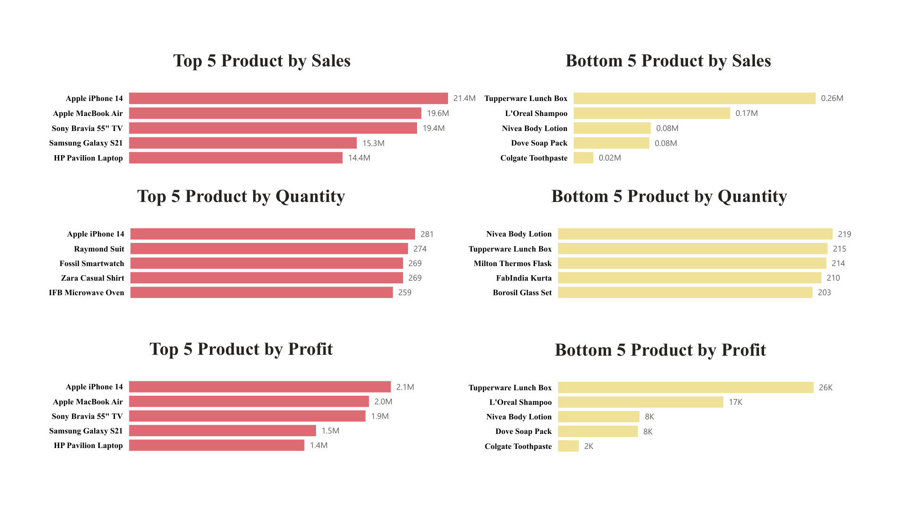
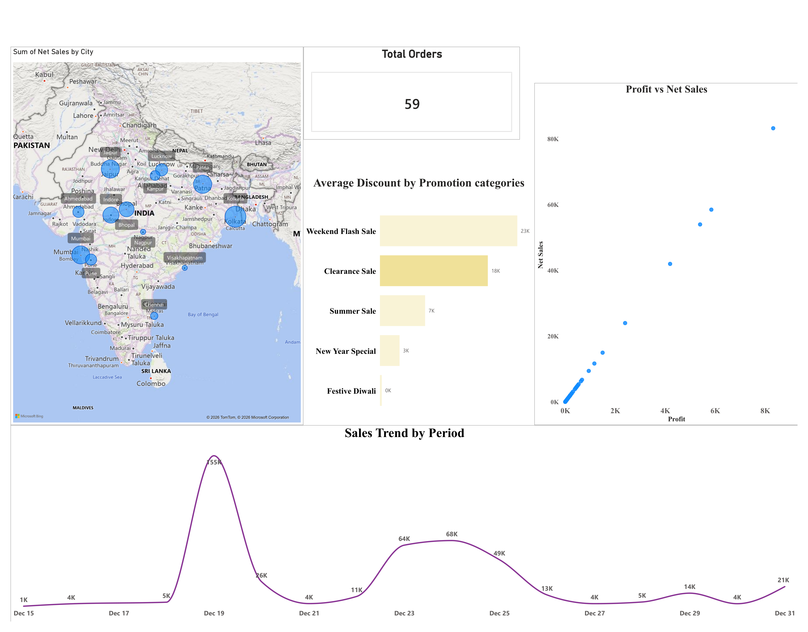
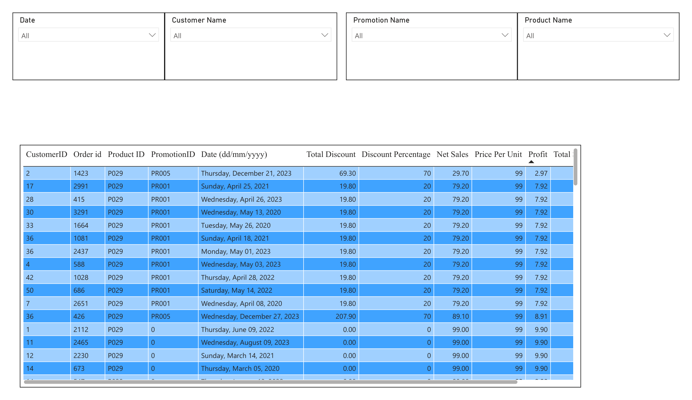

# 📊 ElectroHub Sales Analysis – Power BI

## 📌 About the Project

A Power BI dashboard built to analyze **sales, profit, products, discounts, orders, and city-wise performance** for ElectroHub.

The project focuses on turning raw sales data into simple, interactive business insights.

## 🛠️ Tools Used

- Power BI
- DAX
- Power Query
- Data Modeling
- Interactive Filters & Slicers
- Microsoft Excel

## 📊 Dashboard Highlights

### Product Performance
- Top 5 & Bottom 5 products by Sales
- Top 5 & Bottom 5 products by Profit
- Top 5 & Bottom 5 products by Quantity Sold

### Sales Analysis
- Sales trends over time
- Sales vs Profit
- Sales by City
- Total Orders
- Average Discount by Promotion Category

### Period Comparison

Compare two selected periods based on:

- Sales
- Profit
- Quantity Sold

### Detailed Order Analysis

Filter and explore individual orders using:

- Date
- Customer
- Product
- Promotion

## 🖼️ Dashboard Preview

### Product Performance

### Sales Overview

### Detailed Order Analysis

## 🚀 How to Use

### Open the Power BI Project

1. Install **Power BI Desktop**.
2. Download `Sales_Data_PowerBI_Project.pbix`.
3. Open the `.pbix` file in Power BI Desktop.
4. Use the report tabs and filters to explore the dashboard.

> Power BI Desktop is currently available for Windows. macOS users need a supported Windows environment to open the `.pbix` file.

### Dataset

The original Excel dataset used for the project is included as:

`Store_Data.xlsx`

## 💡 Key Takeaway

This project demonstrates how **Power BI can transform sales data into an interactive dashboard for product, profitability, time, promotion, geographic, and order-level analysis.**
